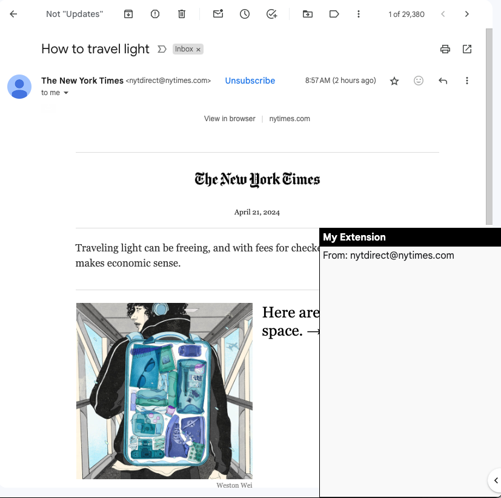

## Gmail React Chrome Extension

This is bowlerplate repo for building React-based Chrome Extension for Gmail.

## React Based

The boilerplate loads the React App into the Gmail page and supplies the gmail object which you can observe.

```jsx
const App = (props) => {
    const { gmail } = props;
    const [userOpened, setUserOpened] = useState(true); 
    const [fromAddress, setFromAddress] = useState(''); 
    
    gmail.observe.on("view_email", (domEmail) => {
        const emailData = gmail.new.get.email_data(domEmail);
        setFromAddress(emailData.from.address);
    });

    const toggleUserOpened = () => {
        setUserOpened(!userOpened);
    };

    const panelStyle = {
        height: (userOpened) ? '50vh' : 'auto', 
    }

    return (
        <div id="sidePanel" style={panelStyle}>
            <div onClick={toggleUserOpened} style={headerStyle}>
                <b>My Extension</b>
            </div>          
            {
                userOpened && (
                    <div id="content" style={bodyStyle}>
                        {fromAddress && <span>From: {fromAddress}</span>}
                    </div>
                )
            }
        </div>
    );
}
```



## For Gmail

Using [gmail.js](https://github.com/KartikTalwar/gmail.js/) it can observe gmail events.  For example:

```javascript
    gmail.observe.on("view_email", (domEmail) => {
        const emailData = gmail.new.get.email_data(domEmail);
        setFromAddress(emailData.from.address);
    });
```

## Purpose

For educational purposes only.  See MIT License.

## Usage

First get the code and build it:

````
npm install
npm update
npm run build
````